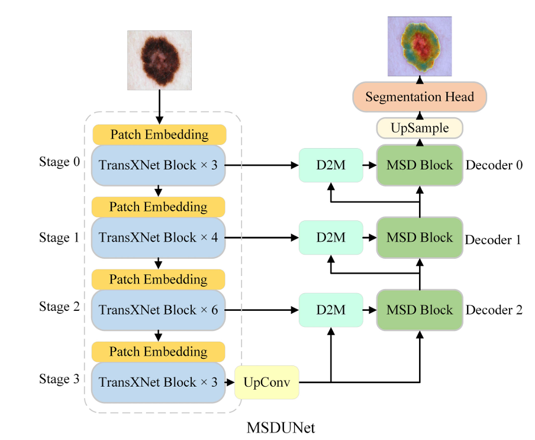
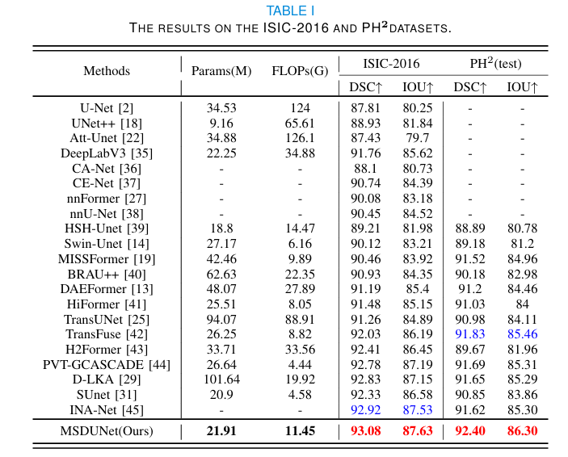
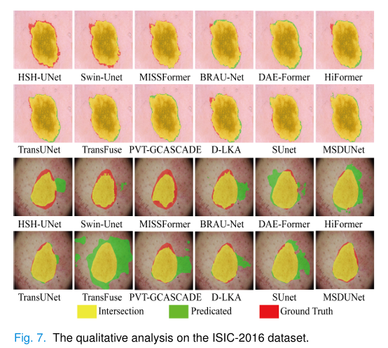
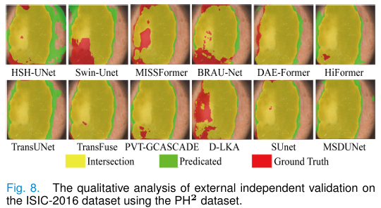

# MSDUNet (IEEE TMI 2025)

### 📖 [**Paper**](https://ieeexplore.ieee.org/document/10916741)

PyTorch implementation of "**MSDUNet: A Model based on Feature Multi-Scale and Dual-input Dynamic Enhancement for Skin Lesion Segmentation**," published in **IEEE Transactions on Medical Imaging (TMI), 2025**.

- **Authors**: [Xiaosen Li], [Linli Li], [Xinlong Xing], [Huixian Liao], [Wenji Wang], [Qiutong Dong], [Xiao Qin]* and [Chang'an Yuan]* .
- **Affiliation**: [Guangxi Key Lab of Human-machine Interaction and Intelligent Decision]

---

## 🚀 News
- **[03, 2025]**: 🥳The code and pre-trained models has be released.
- **[03, 2025]**: 🏆Good news, our paper was accepted by TMI. The code and pre-trained models will be released soon.
- **[04, 2024]**: Our MSDUNet achieves new SOTA performance on public skin lesion segmentation datasets.

---

## 📜 Abstract
> Melanoma is a malignant tumor originating from the lesions of skin cells. Medical image segmentation tasks for skin lesion play a crucial role in quantitative analysis. Achieving precise and efficient segmentation remains a significant challenge for medical practitioners. Hence, a skin lesion segmentation model named MSDUNet, which incorporates multi-scale deformable block (MSD Block) and dual-input dynamic enhancement module(D2M), is proposed. Firstly, the model employs a hybrid architecture encoder that better integrates global and local features. Secondly, to better utilize macroscopic and microscopic multiscale information, improvements are made to skip connection and decoder block, introducing D2M and MSD Block. The D2M leverages large kernel dilated convolution to draw out attention bias matrix on the decoder features, supplementing and enhancing the semantic features of the decoder’s lower layers transmitted through skip connection features, thereby compensating semantic gaps. The MSD Block uses channel-wise split and deformable convolutions with varying receptive fields to better extract and integrate multi-scale information while controlling the model’s size, enabling the decoder to focus more on task-relevant regions and edge details. MSDUNet attains outstanding performance with Dice scores of 93.08\% and 91.68\% on the ISIC-2016 and ISIC-2018 datasets, respectively. Furthermore, experiments on the HAM10000 dataset demonstrate its superior performance with a Dice score of 95.40\%. External validation experiments based on the ISIC-2016, ISIC-2018, and HAM10000 experimental weights on the PH$^2$ dataset yield Dice scores of 92.67\%, 92.31\%, and 93.46\%, respectively, showcasing the exceptional generalization capability of MSDUNet.

---

## 🏗️ Network Architecture


---

## 📦 Installation
```bash
git clone https://github.com/XSforAI/MSDUNet.git
cd MSDUNet
pip install -r requirements.txt

```

### **Requirements**
> * CUDA 11.3+
> * Python 3.8+
> * PyTorch 1.11.0+
> * Torchvision 0.11.0+
> * NumPy, OpenCV, scikit-learn, Matplotlib, etc.

---

## 📂 Dataset
We evaluate **MSDUNet** on multiple publicly available skin lesion datasets:

| Dataset   | Link                                                                          |
|-----------|-------------------------------------------------------------------------------|
| ISIC 2016 | [Download](https://challenge.isic-archive.com/data/#2016)                     |
| ISIC 2018 | [Download](https://challenge.isic-archive.com/data/#2018)                     |
| HAM10000  | [Download](https://www.kaggle.com/datasets/kmader/skin-cancer-mnist-ham10000) |
| PH2       | [Download](https://www.fc.up.pt/addi/ph2%20database.html)                     |

### **Dataset Folder Structure**
Organize the dataset as follows:
```
- datasets
  - ISIC2016
    - train
      - images
      - masks
    - val
      - images
      - masks
    - test
      - images
      - masks
```

---

## 📥 Pre-trained Models
Download the pre-trained weights for different datasets:

| Dataset   | Google Drive | Baidu Cloud                                                             |
|-----------|--------------|-------------------------------------------------------------------------|
| ISIC 2016 | [Google Drive](https://drive.google.com/file/d/1HwBx0DDRB-C7R89GTxcypTtM9WFU-hCu/view?usp=drive_link) | [Baidu Cloud](https://pan.baidu.com/s/1AnFOs6_xKOv75IdNl6h4aA?pwd=jxrw) |
| ISIC 2018 | [Google Drive](https://drive.google.com/file/d/1g5D_KszuwionLI-Vm5AHGDomaMbkBG15/view?usp=drive_link) | [Baidu Cloud](https://pan.baidu.com/s/1oSjbGQgNdurzsKTIDYzGow?pwd=4n3j) |
| HAM 10000 | [Google Drive](https://drive.google.com/file/d/182GsjXU1xELDBfAatrj-i7TfkFZ-bbEK/view?usp=drive_link) | [Baidu Cloud](https://pan.baidu.com/s/1XWnUuQM5sdKhy122RZmonQ?pwd=jz7e) |

---

## 🏃 Usage
### **Quick Test**
Download the pre-trained model:

### **Training**
```bash
python train_ISIC2016.py
```

### **Inference**
```bash
python test_ISIC2016.py
```

---

## 🎯 Results
### **Quantitative Performance**


### **Qualitative Results**
#### **Results on ISIC2016**


#### **External Testing on PH²**


---

## 🙏 Acknowledgments
We also acknowledge the authors of **[D-LKA](https://github.com/xmindflow/deformableLKA), [SUnet](https://github.com/XSforAI/SUnet), [G-CASCADE](https://github.com/SLDGroup/G-CASCADE)**, and other baseline models for their valuable contributions to medical image segmentation.

---

## 📩 Contact
If you have any questions, please feel free to contact us:
- **Email**: xiaosenforai@gmail.com
- **GitHub Issues**: [Open an Issue](https://github.com/XSforAI/MSDUNet/issues)

---

## 📖 Citation
If you find this work useful, please consider citing our early access paper:
```bibtex
@ARTICLE{10916741,
  author={Li, Xiaosen and Li, Linli and Xing, Xinlong and Liao, Huixian and Wang, Wenji and Dong, Qiutong and Qin, Xiao and Yuan, Chang’an},
  journal={IEEE Transactions on Medical Imaging}, 
  title={MSDUNet:A Model based on Feature Multi-Scale and Dual-input Dynamic Enhancement for Skin Lesion Segmentation}, 
  year={2025},
  volume={},
  number={},
  pages={1-1},
  keywords={Image segmentation;Transformers;Decoding;Convolution;Lesions;Feature extraction;Skin;Semantics;Kernel;Adaptation models;Hybrid architecture;skin lesion segmentation;multi-scale method;deformable convolution;feature enhancement},
  doi={10.1109/TMI.2025.3549011}}
```

---

⭐ **If you like this work, please consider starring the repository!** 😊

